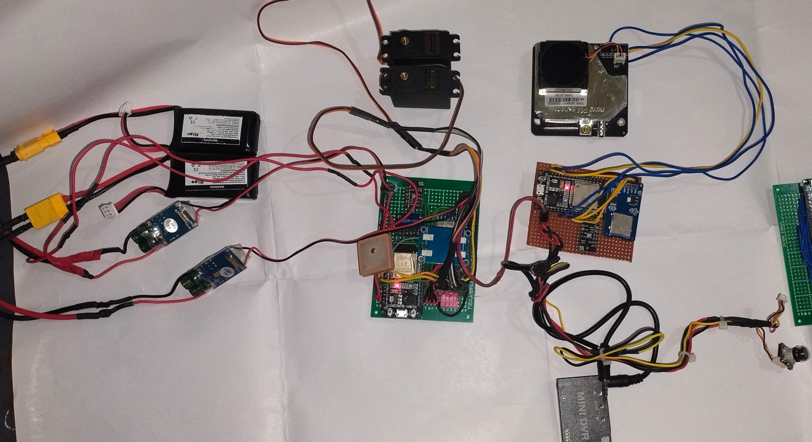

# Basilian-01 Rocket Avionics

## Overview
**DEVELOPMENT OF A FAULT-TOLERANT ROCKET AVIONICS HARDWARE SYSTEM FOR FLIGHT CONTROL AND AEROSOL MONITORING**

The hardware design and integration of Basilian-01 present a model rocket avionics system developed for reliable flight monitoring, effective recovery control, and atmospheric aerosol data acquisition. This project is centered on a dual-redundant embedded hardware architecture to enhance mission reliability and eliminate single-point failures during critical flight phases.

### Team Members
* AADIL MUHAMMED
* BEVAL PHILIP MATHEW
* RAHUL B
* SIBI B JOHN

*Mar Baselios Christian College of Engineering and Technology*

## Abstract
The avionics hardware integrates multiple subsystems including barometric altitude sensors, an inertial measurement unit (IMU), GPS module, LoRa-based telemetry transceiver, SD card data logger, servo-based parachute deployment mechanism, and an aerosol sensing module for in-flight atmospheric particulate measurement. Aerosol data is collected during ascent and descent phases to enable analysis of particulate concentration variations with altitude. All recovery-critical operations operate autonomously on-board, independent of ground systems. Emphasis is placed on robust power distribution, signal interfacing, sensor integration, and redundancy-oriented hardware design.

## Features
- **Fault-Tolerant Architecture**: Dual-redundant ESP32-based flight controllers.
- **Flight Event Detection**: Finite State Machine for Launch, Apogee, and Landing detection based on dual-sensor voting.
- **Autonomous Recovery**: Servo-controlled parachute deployment at apogee, with backup logic triggers.
- **Payload Module**: Aerosol sensing capability using optical scattering for environmental data logging.
- **Long-Range Telemetry**: 433 MHz LoRa transceiver for high-reliability data links.
- **Machine Intelligence**: Edge-processing capabilities for aerosol feature extraction (moving average filtering and decision tree classification).
- **Redundant Power Distribution**: Multiple UBECs on dedicated Li-Po batteries with isolated logic/actuator rails.
- **Ground Control Dashboard**: A full real-time Next.js and Flask/WebSocket web dashboard to visualize telemetry, map tracking, and command execution.

## Telemetry Dashboard Previews

*(Telemetry PRO: Unified Mission Control Dashboard)*

*(Real-time atmospheric analytics and descent velocity tracking)*

> **View the Complete Application Gallery**: For a deep dive into the individual dashboard elements (Map Tracking, Attitude Indicators, and Packet Histories), explore the **[Full Web Interface Gallery](docs/dashboard_gallery.md)**.

## 📚 Documentation Guide

This repository is split into highly specialized documents so you can easily explore specific parts of the project:

### 1. The Academic Core
- 📖 **[`docs/project_phase_2_report.md`](docs/project_phase_2_report.md)**: The crown jewel. The complete Phase II university report spanning 18 chapters detailing the literature survey, component tolerances, scientific derivations, and hardware validation.

### 2. The Physical Hardware
- 🔌 **[`docs/hardware_design.md`](docs/hardware_design.md)**: The electronic blueprints. Details the pin mappings and displays the actual circuit schematics alongside photos of the real-world soldered hardware (Onboard Unit, Ground Station, Wireless Ignition).

### 3. The Flight Logic
- 🧠 **[`docs/software_architecture.md`](docs/software_architecture.md)**: The fundamental logic concepts. Explains the timeline of the Finite State Machine and how apogee detection algorithms dictate parachute deployment.
- ⚙️ **[`docs/code_structure_and_details.md`](docs/code_structure_and_details.md)**: The exact firmware breakdown. Explains how the raw C++ `.ino` code manages sensors, servos, and SPI telemetry.

### 4. The Mission Control Web App
- 💻 **[`docs/dashboard_frontend.md`](docs/dashboard_frontend.md)** & **[`docs/dashboard_backend.md`](docs/dashboard_backend.md)**: Explains the full-stack architecture. Details how Next.js handles the 3D GUI and how Python/Flask pipes raw LoRa telemetry to WebSockets.
- 🖼️ **[`docs/dashboard_gallery.md`](docs/dashboard_gallery.md)**: A visual showcase gallery displaying screenshots of every active user interface in the Ground Control software.

### Source Directories
- `firmware/` : The raw executable `.ino` code for the dual ESP32s and payload loggers.
- `Web_Dashboard/` : Front-end (React/Next.js) and Back-end (Flask/PostgreSQL) source code.
- `images/`: Assets, photos, and diagrams.

## Getting Started
See the [Hardware Design Document](docs/hardware_design.md) for pinouts and schematic references.

1. **Flight Controller Firmware**: Open `firmware/flight_controller/flight_controller.ino` using the Arduino IDE. Flash to ESP32-A and ESP32-B. Ensure the required libraries (ESP32Servo, Adafruit_BME280, TinyGPSPlus, LoRa) are installed. 
2. **Ground Station Firmware**: Flash `firmware/ground_station/ground_station.ino` to the Ground Control ESP32.
3. **Dashboard Setup**: Proceed to the `Web_Dashboard` directory to deploy the React front-end and Flask back-end for tracking.

## Authors
Developed as part of a Bachelor of Technology curriculum requirement in Electronics and Communication Engineering (2025-2026).
