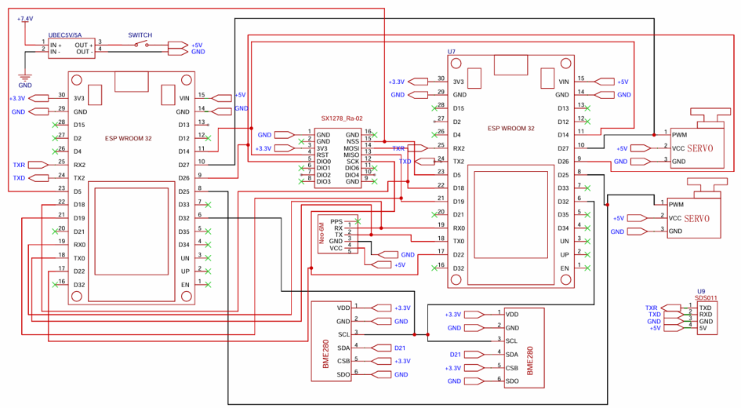
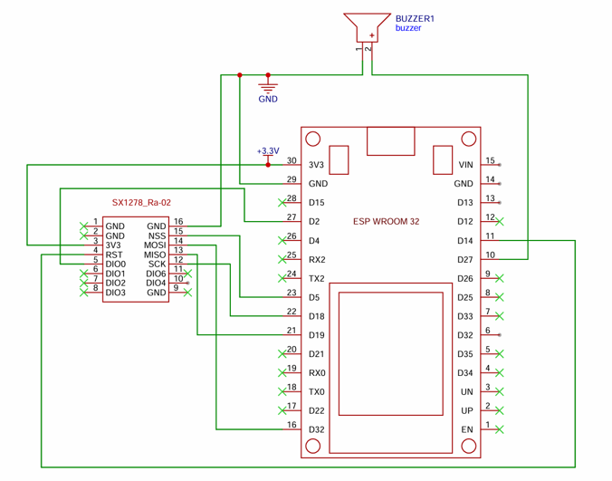
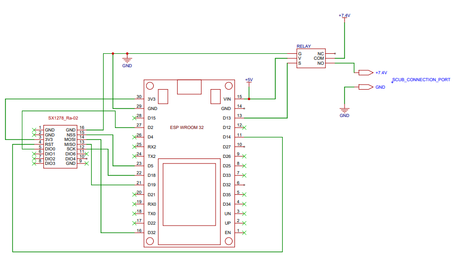
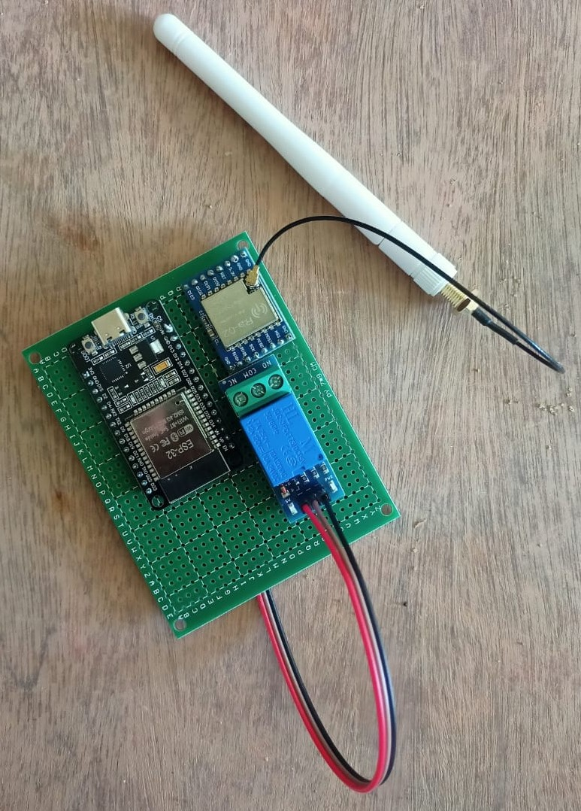

# Hardware Design & Subsystems

This document describes the design specifications of the major hardware subsystems located onboard the Basilian-01 rocket and the associated Ground Control segment.

## 1. Flight Controller (ESP32)
The ESP32 microcontroller is the primary flight controller for the Basilian-01 rocket due to its high processing capability and peripheral support. The dual-core 32-bit architecture handles real-time data acquisition, sensor fusion, state estimation, communication, and storage operations seamlessly. 

The onboard system employs two ESP32 microcontrollers configured in an active-active redundant mode to eliminate single-point failures. 

## 2. Communication System (LoRa 433 MHz)
The telemetry system relies on an SX1278 LoRa module operating at 433 MHz. LoRa provides long-distance communication with minimal data overhead and chirp spread spectrum modulation for interference resistance. The TX power operates at +17 dBm using an SPI interface to the ESP32.

## 3. Data Logging Module (SD Card)
Real-time sensor data transmission can fail at extreme speeds/altitudes. An SPI-based SD Card logger records all measurements in a structured (CSV/Binary) format. This creates a fail-safe localized memory loop ensuring critical flight data is never fully lost.

## 4. Sensor Modules

### 4.1 MPU6050 (IMU)
A 6-DOF Inertial Measurement Unit (IMU) providing a 3-axis accelerometer and 3-axis gyroscope over I2C. Used to determine linear acceleration and angular velocity for orientation tracking, launch detection, stability assessment, and flight stage evaluation.

### 4.2 BME280 (Environmental)
Measures temperature, humidity, and atmospheric pressure. Essential for calculating real-time barometric altitude estimation required for apogee detection. Pressure calculations are smoothed via moving average filters. BME280 sensors are individually wired to both ESP32-A and ESP32-B for true redundancy.

### 4.3 GPS Module (NEO-6M)
Connected via UART, the GPS subsystem provides constant location tracking (Latitude, Longitude), velocity tracking, and accurate timestamps. Retains power via battery backup for quick lock times during flight preparation.

### 4.4 Aerosol Detection Payload 
Uses an optical scattering particulate sensor to measure suspended mass and particle concentrations at different vertical strata of the atmosphere, gathering important meteorological data.

## 5. Recovery & Deployment 
The recovery relies on a servo-controlled deployment logic to actuate parachute releases without volatile pyrotechnic charges. Servo-1 is primary, Servo-2 is secondary/backup. Activation logic triggers dynamically when peak altitude starts dropping under a predefined threshold across several iterative time cycles.

## 6. Power Distribution 
On-board logic and servos are powered by a 2S/3S Li-Po battery. Highly sensitive electronics (ESP32s, sensors) run behind separated 5V/3.3V Universal Battery Elimination Circuits (UBECs) independent from the power tracks given to the load-spiking Servo motors. 

### Derating Analysis Guidelines
* Maximum theoretical current for peak RX/TX: ~200-260 mA per ESP32/LoRa
* Regulator limits: 1.5A per UBEC
* Using an 80% continuous rating ensures 1.2A of maximum safe load ceiling. Average power spans between ~20-50% peak capacity preventing heat dissipation and voltage dip resets.

---
## Flight Controller Pinout Specifications (ESP32-A)
| **Function** | **GPIO Pin** | **Bus/Protocol** |
|:---|:---:|:---:|
| BME280 SDA | 21 | I2C |
| BME280 SCL | 22 | I2C |
| MPU6050 SDA | 21 | I2C (shared) |
| MPU6050 SCL | 22 | I2C (shared) |
| GPS RX (from NEO-6M) | 16 | UART1 |
| GPS TX (to NEO-6M) | 17 | UART1 |
| LoRa SX1278 CS | 5 | SPI |
| LoRa SX1278 MOSI | 23 | SPI |
| LoRa SX1278 MISO | 19 | SPI |
| LoRa SX1278 CLK | 18 | SPI |
| LoRa SX1278 RST | 14 | GPIO |
| LoRa SX1278 DIO0 | 26 | GPIO(Int) |
| Servo-A PWM | 12 | GPIO |
| SD Card CS | 4 | SPI |
| Battery ADC | 35 | ADC |

## 7. Circuit Schematics

### 7.1 Onboard Flight Controller Schematic

**Description:** The primary onboard avionics module features a fully redundant architecture. It comprises two active **ESP-WROOM-32** microcontrollers running in parallel. Power drops down from the 7.4V source via a reliable 5V/5A UBEC to power the logic rails safely. Critical sensors are routed to the primary MCU, including the **NEO-6M GPS** (via UART), **SX1278 LoRa** transceiver (via SPI), and the **BME280** array (via I2C). Furthermore, dual Parachute/Fin servo PWM lines and the **SDS011** laser particulate (Aerosol) payload are distinctly interfaced to provide real-time mechanical control and continuous particulate monitoring. 

### 7.2 Ground Station Schematic

**Description:** The Ground Station receiver unit operates centrally on a single **ESP-WROOM-32** coupled with an independent **SX1278 LoRa** transceiver. This unit actively listens on the 433 MHz band. A key identifier includes the **Passive Buzzer** wired to GPIO 27, ensuring audible alerts (`BEEP_TX`, `BEEP_RX`) sound immediately upon telemetry packet reception or ground-issued remote command execution bounds (like Launch, Abort, or Eject).

### 7.3 Wireless Ignition (SCUB) Schematic

**Description:** Built primarily to act remote sequence arming logic without manual intervention. This separate **ESP-WROOM-32** triggers a mechanical **Relay Module** connected downstream. When the wireless Launch / Arm command is intercepted on its **SX1278 LoRa** antenna, it latches the Relay's common voltage (7.4V input) seamlessly across the normally-open (NO) pole to the **SCUB Connection Port**, securely initiating the ignition path or pyrotechnic deployment mechanism.
